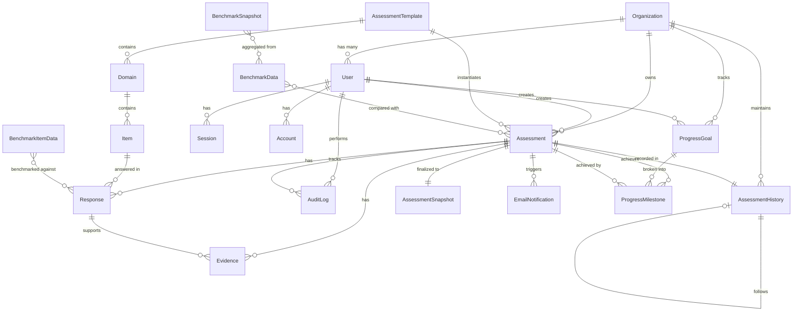
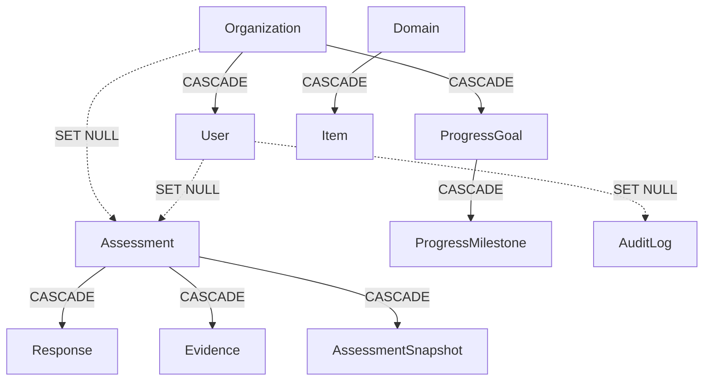

# Database Design & Architecture
**AI Maturity Assessment Platform - World-Class Technical Documentation**

---

## Table of Contents

1. [Database Overview](#database-overview)
2. [Entity Relationship Diagram](#entity-relationship-diagram)
3. [Core Entities](#core-entities)
4. [Data Flow Diagrams](#data-flow-diagrams)
5. [Indexing Strategy](#indexing-strategy)
6. [Data Integrity Rules](#data-integrity-rules)

---

## Database Overview

### Technology Stack
- **Database**: PostgreSQL 15+
- **ORM**: Prisma
- **Schema Management**: Prisma Migrations
- **Connection Pooling**: Built-in Prisma connection pooling

### Design Principles
1. **Multi-tenancy**: Organization-based data isolation
2. **Audit Trail**: Immutable audit logs for compliance
3. **Versioning**: Template versioning for backwards compatibility
4. **Soft Deletes**: SetNull cascades for audit preservation
5. **Performance**: Strategic indexing on high-query fields
6. **Data Integrity**: Enforced through constraints and validations

---

## Entity Relationship Diagram



---

## Core Entities

### 1. Organization & Users

#### Organization
**Purpose**: Multi-tenant organization management

| Field | Type | Description |
|-------|------|-------------|
| id | String (CUID) | Primary key |
| name | String | Organization name |
| industry | String? | Industry classification |
| size | String? | Organization size (small/medium/large/enterprise) |
| region | String? | Geographic region (VN/SEA/APAC) |
| createdAt | DateTime | Creation timestamp |
| updatedAt | DateTime | Last update timestamp |

**Relationships**:
- Has many Users
- Has many Assessments
- Has many ProgressGoals
- Has many AssessmentHistory records

---

#### User
**Purpose**: User authentication and authorization

| Field | Type | Description |
|-------|------|-------------|
| id | String (CUID) | Primary key |
| email | String (unique) | User email |
| emailVerified | Boolean | Email verification status |
| name | String? | Full name |
| image | String? | Profile image URL |
| role | Enum | OWNER/ADMIN/REVIEWER/RESPONDENT/VIEWER |
| organizationId | String? | FK to Organization |
| lastLoginAt | DateTime? | Last login timestamp |

**Role Hierarchy**:
```
OWNER (Full access to organization)
  └─ ADMIN (Manage templates, users, view all assessments)
      └─ REVIEWER (Review and approve assessments)
          └─ RESPONDENT (Fill assessments)
              └─ VIEWER (Read-only access)
```

**Indexes**:
- `email` (unique, for login)
- `organizationId` (for filtering by org)

---

### 2. Assessment Template Structure

#### AssessmentTemplate
**Purpose**: Versioned assessment template definition

| Field | Type | Description |
|-------|------|-------------|
| id | String (CUID) | Primary key |
| version | String (unique) | Version identifier (e.g., "v1.0") |
| name | String | Template name |
| nameEn | String? | English name |
| description | Text? | Template description |
| isActive | Boolean | Active status |

**Key Features**:
- Versioned for backwards compatibility
- Only one active version at a time
- Assessments reference specific versions

---

#### Domain
**Purpose**: Assessment domain grouping (5 domains)

| Field | Type | Description |
|-------|------|-------------|
| id | String (CUID) | Primary key |
| code | String | Domain code (data/infra/tech/org/policy) |
| name | String | Domain name in Vietnamese |
| nameEn | String? | Domain name in English |
| weight | Float | Domain weight (default: 1.0) |
| sortOrder | Int | Display order |
| templateId | String | FK to AssessmentTemplate |

**5 Standard Domains**:
1. **data** - Dữ liệu (Data)
2. **infra** - Hạ tầng (Infrastructure)
3. **tech** - Công nghệ (Technology)
4. **org** - Tổ chức (Organization)
5. **policy** - Chính sách (Policy)

**Constraints**:
- Unique combination: `(templateId, code)`

---

#### Item
**Purpose**: Individual assessment questions (37 items total)

| Field | Type | Description |
|-------|------|-------------|
| id | String (CUID) | Primary key |
| itemCode | String | Item code (1.1, 1.2, ..., 5.2) |
| itemName | Text | Item name/question |
| itemNameEn | Text? | English translation |
| domainId | String | FK to Domain |
| level1-5 | Text | Maturity level descriptions |
| weight | Float | Item weight (default: 1.0) |
| sortOrder | Int | Display order |
| evidenceRequired | Boolean | Whether evidence is required |
| evidenceRequiredIfLe | Int? | Require evidence if score <= value |
| allowedFileTypes | String[] | Allowed file types |

**Maturity Levels**:
- **Level 1**: Sơ khai (Initial)
- **Level 2**: Khởi đầu (Beginning)
- **Level 3**: Phát triển (Developing)
- **Level 4**: Trưởng thành (Mature)
- **Level 5**: Tối ưu (Optimized)

**Constraints**:
- Unique combination: `(domainId, itemCode)`

---

### 3. Assessment & Responses

#### Assessment
**Purpose**: Assessment instance (draft or finalized)

| Field | Type | Description |
|-------|------|-------------|
| id | String (CUID) | Primary key |
| sessionId | String? (unique) | Guest session identifier |
| userId | String? | FK to User (null if guest) |
| organizationId | String? | FK to Organization |
| templateId | String | FK to AssessmentTemplate |
| status | Enum | DRAFT/IN_PROGRESS/PENDING_REVIEW/FINALIZED |
| industry | String? | Industry for benchmarking |
| size | String? | Organization size |
| region | String? | Geographic region |
| createdAt | DateTime | Creation timestamp |
| updatedAt | DateTime | Last update |
| finalizedAt | DateTime? | Finalization timestamp |
| expiresAt | DateTime? | Expiration for guest drafts (30 days) |

**Status Flow**:
```
DRAFT → IN_PROGRESS → PENDING_REVIEW → FINALIZED
  ↓                                        ↑
  └────────────────────────────────────────┘
         (Can skip PENDING_REVIEW)
```

**Guest vs Authenticated**:
- **Guest**: Has `sessionId`, no `userId`
- **Authenticated**: Has `userId`, may have `organizationId`

**Indexes**:
- `sessionId` (unique, for guest lookup)
- `userId` (for user's assessments)
- `organizationId` (for org's assessments)
- `status` (for filtering)
- `finalizedAt` (for completed assessments)
- `expiresAt` (for cleanup jobs)

---

#### Response
**Purpose**: User's answer to an assessment item

| Field | Type | Description |
|-------|------|-------------|
| id | String (CUID) | Primary key |
| assessmentId | String | FK to Assessment |
| itemId | String | FK to Item |
| **score** | **Int?** | **Answer (1-5 or NULL)** |
| currentState | Text? | User's description |

**CRITICAL: Score Field**
```typescript
score: Int?  // NULLABLE! Not 0!

Valid values:
  - null:  Question not answered yet
  - 1-5:   Valid answer (maturity level)

NEVER:
  - 0:     Invalid! Should be null instead
```

**Why Nullable?**
- Allows saving draft responses without scores
- Progress calculation counts only valid scores (1-5)
- Finalize validation requires minimum 50% valid scores

**Constraints**:
- Unique combination: `(assessmentId, itemId)`

**Indexes**:
- `assessmentId` (for loading assessment responses)

---

### 4. Evidence Management

#### Evidence
**Purpose**: File uploads supporting responses

| Field | Type | Description |
|-------|------|-------------|
| id | String (CUID) | Primary key |
| assessmentId | String | FK to Assessment |
| responseId | String? | FK to Response |
| fileName | String | Original filename |
| fileType | String | MIME type |
| fileSize | Int | Size in bytes |
| storageUrl | String | S3 URL or local path |
| storageKey | String | S3 key |
| checksum | String | SHA-256 checksum |
| description | Text? | User description |
| uploadedBy | String? | userId or "guest-{sessionId}" |
| itemCode | String? | Associated item |
| virusScanned | Boolean | Scan status |
| scanResult | String? | Scan result |
| uploadedAt | DateTime | Upload timestamp |

**Storage Strategy**:
- **Production**: AWS S3 with pre-signed URLs
- **Development**: Local filesystem

**Security**:
- Virus scanning required
- Checksum verification
- Access control via pre-signed URLs

---

### 5. Scoring & Results

#### AssessmentSnapshot
**Purpose**: Immutable snapshot of finalized assessment

| Field | Type | Description |
|-------|------|-------------|
| id | String (CUID) | Primary key |
| assessmentId | String (unique) | FK to Assessment |
| itemScores | JSON | `{ "itemId": score, ... }` |
| domainScores | JSON | `{ "code": avgScore, ... }` |
| totalScore | Float | Overall average (1.0 - 5.0) |
| maturityLevel | String | Overall level (Sơ khai - Tối ưu) |
| templateVersion | String | Template version used |
| numResponses | Int | Number of responses |
| completeness | Float | Percentage answered |
| snapshotData | JSON | Full assessment data |
| checksum | String | SHA-256 of snapshotData |

**Immutability**:
- Created once when assessment is finalized
- Never updated (immutable audit trail)
- Preserved even if responses are modified later

**JSON Structure**:
```json
{
  "itemScores": {
    "item-id-1": 3,
    "item-id-2": 4,
    ...
  },
  "domainScores": {
    "data": 3.5,
    "infra": 4.0,
    "tech": 3.2,
    "org": 3.8,
    "policy": 3.6
  }
}
```

---

### 6. Benchmark Data

#### BenchmarkData (Domain-level)
**Purpose**: Anonymous benchmark statistics by industry/size

| Field | Type | Description |
|-------|------|-------------|
| industry | String | Industry classification |
| size | String | Organization size |
| region | String? | Geographic region |
| domainCode | String | Domain code |
| avgScore | Float | Average score |
| p25, p50, p75, p90 | Float | Percentiles |
| minScore, maxScore | Float | Min/max scores |
| stdDev | Float | Standard deviation |
| maturityDistribution | JSON? | Level distribution |
| sampleSize | Int | Number of assessments |

**Constraints**:
- Unique: `(industry, size, domainCode)`

**Indexes**:
- `industry` (for filtering)
- `domainCode` (for domain comparison)
- `region` (for regional filtering)

---

#### BenchmarkItemData (Item-level)
**Purpose**: Detailed item-level benchmark statistics

| Field | Type | Description |
|-------|------|-------------|
| industry | String | Industry classification |
| size | String | Organization size |
| region | String? | Geographic region |
| itemCode | String | Item code (1.1, 1.2, etc.) |
| avgScore | Float | Average score |
| p25, p50, p75, p90 | Float | Percentiles |
| scoreDistribution | JSON? | Score distribution |
| sampleSize | Int | Number of responses |

**Score Distribution JSON**:
```json
{
  "1": 10,  // 10 responses with score 1
  "2": 20,  // 20 responses with score 2
  "3": 30,  // etc.
  "4": 25,
  "5": 15
}
```

---

#### BenchmarkSnapshot (Historical)
**Purpose**: Point-in-time benchmark snapshots for trends

| Field | Type | Description |
|-------|------|-------------|
| snapshotDate | DateTime | Snapshot date |
| industry | String | Industry |
| size | String | Organization size |
| domainScores | JSON | Domain-level aggregates |
| itemScores | JSON | Item-level aggregates |
| overallScore | Float | Overall average |
| sampleSize | Int | Total assessments |
| templateVersion | String | Template version |

**Usage**:
- Monthly/quarterly snapshots
- Trend analysis over time
- Historical comparisons

---

### 7. Email Notifications

#### EmailNotification
**Purpose**: Email sending tracking and status

| Field | Type | Description |
|-------|------|-------------|
| assessmentId | String | FK to Assessment |
| recipientEmail | String | Recipient email |
| recipientName | String? | Recipient name |
| subject | String | Email subject |
| templateName | String | Email template used |
| status | Enum | Email status |
| sentAt | DateTime? | Send timestamp |
| deliveredAt | DateTime? | Delivery confirmation |
| openedAt | DateTime? | Open tracking |
| clickedAt | DateTime? | Click tracking |
| attempts | Int | Send attempts |
| lastError | Text? | Last error message |
| attachments | JSON? | Attachment file keys |

**Status Flow**:
```
PENDING → SENDING → SENT → DELIVERED → OPENED → CLICKED
    ↓         ↓
  FAILED   BOUNCED
```

**Indexes**:
- `assessmentId` (for assessment emails)
- `recipientEmail` (for user's emails)
- `status` (for queue processing)
- `sentAt` (for retry logic)

---

### 8. Progress Tracking

#### ProgressGoal
**Purpose**: Organization improvement goals

| Field | Type | Description |
|-------|------|-------------|
| organizationId | String | FK to Organization |
| userId | String? | Goal creator |
| goalType | Enum | Type of goal |
| targetScore | Float? | Target score |
| targetLevel | String? | Target maturity level |
| domainCode | String? | Specific domain |
| itemCode | String? | Specific item |
| currentValue | Float? | Starting value |
| targetValue | Float | Target to achieve |
| targetDate | DateTime | Target date |
| status | Enum | ACTIVE/ACHIEVED/MISSED/CANCELLED |
| achievedAt | DateTime? | Achievement timestamp |
| title | String | Goal title |
| priority | Enum | LOW/MEDIUM/HIGH/CRITICAL |

**Goal Types**:
1. **OVERALL_SCORE**: Improve overall score
2. **MATURITY_LEVEL**: Reach maturity level
3. **DOMAIN_SCORE**: Improve domain score
4. **ITEM_SCORE**: Improve item score
5. **BENCHMARK_RANK**: Reach percentile rank

---

#### ProgressMilestone
**Purpose**: Intermediate milestones within goals

| Field | Type | Description |
|-------|------|-------------|
| goalId | String | FK to ProgressGoal |
| title | String | Milestone title |
| targetValue | Float | Intermediate target |
| targetDate | DateTime | Target date |
| status | Enum | Milestone status |
| achievedAt | DateTime? | Achievement timestamp |
| assessmentId | String? | Assessment that achieved it |

**Example**:
```
Goal: Reach 4.0 overall score by Q4 2025

Milestones:
  - Q1 2025: Reach 3.2 (✓ Achieved)
  - Q2 2025: Reach 3.5 (⏳ In Progress)
  - Q3 2025: Reach 3.8 (⏸ Pending)
  - Q4 2025: Reach 4.0 (⏸ Pending)
```

---

#### AssessmentHistory
**Purpose**: Historical tracking of organization assessments

| Field | Type | Description |
|-------|------|-------------|
| organizationId | String | FK to Organization |
| assessmentId | String (unique) | FK to Assessment |
| overallScore | Float | Score snapshot |
| maturityLevel | String | Level snapshot |
| domainScores | JSON | Domain scores |
| previousAssessmentId | String? | Previous assessment |
| scoreChange | Float? | Score difference |
| levelChange | Int? | Level change (-2 to +2) |
| improvementRate | Float? | % improvement |
| daysSincePrevious | Int? | Days between |
| assessmentNumber | Int | Sequence number (1, 2, 3...) |

**Linked List Structure**:
```
Assessment 1 (Score: 2.5)
    ↓ (scoreChange: +0.7, 90 days)
Assessment 2 (Score: 3.2)
    ↓ (scoreChange: +0.5, 120 days)
Assessment 3 (Score: 3.7)
```

---

### 9. Audit & Compliance

#### AuditLog
**Purpose**: Immutable audit trail (append-only)

| Field | Type | Description |
|-------|------|-------------|
| userId | String? | User who performed action |
| assessmentId | String? | Related assessment |
| action | String | Action type |
| entityType | String | Entity affected |
| entityId | String? | Entity ID |
| changes | JSON? | Before/after values |
| ipAddress | String? | Request IP |
| userAgent | String? | Browser info |

**Common Actions**:
- `CREATE`: Entity created
- `UPDATE`: Entity updated
- `DELETE`: Entity deleted
- `LOGIN`: User logged in
- `EXPORT`: Data exported
- `GUEST_LINKED`: Guest assessment linked to user
- `FINALIZE`: Assessment finalized
- `SEND_EMAIL`: Email sent

**Changes JSON**:
```json
{
  "before": { "score": 3, "currentState": "..." },
  "after": { "score": 4, "currentState": "..." }
}
```

**Characteristics**:
- Append-only (no updates or deletes)
- Indexed by action, userId, assessmentId, createdAt
- Preserved even if referenced entities are deleted (SetNull)

---

## Indexing Strategy

### Performance Optimization

| Entity | Indexed Fields | Purpose |
|--------|---------------|---------|
| User | `email` (unique), `organizationId` | Login, org filtering |
| Assessment | `sessionId` (unique), `userId`, `organizationId`, `status`, `finalizedAt`, `expiresAt` | Lookups, filtering, cleanup |
| Response | `assessmentId`, `(assessmentId, itemId)` (unique) | Load responses, prevent duplicates |
| Evidence | `assessmentId`, `responseId`, `uploadedBy` | File management |
| AssessmentSnapshot | `assessmentId` (unique) | Results lookup |
| BenchmarkData | `industry`, `domainCode`, `region`, `(industry, size, domainCode)` (unique) | Comparison queries |
| EmailNotification | `assessmentId`, `recipientEmail`, `status`, `sentAt` | Email tracking |
| ProgressGoal | `organizationId`, `userId`, `status`, `targetDate` | Progress tracking |
| AuditLog | `userId`, `assessmentId`, `action`, `createdAt` | Audit queries |

### Index Maintenance
- Rebuild indexes monthly: `REINDEX DATABASE`
- Monitor index usage: `pg_stat_user_indexes`
- Remove unused indexes: Identified via `idx_scan = 0`

---

## Data Integrity Rules

### Cascading Deletes



**Cascade Rules**:
- **CASCADE**: Delete children when parent deleted
  - Organization → ProgressGoal
  - Assessment → Response, Evidence, Snapshot
  - Domain → Item
  - ProgressGoal → Milestone

- **SET NULL**: Preserve audit trail
  - Organization → Assessment (preserves guest assessments)
  - User → Assessment (preserves assessment data)
  - User → AuditLog (preserves audit history)

### Unique Constraints

1. **User**: `email` (unique globally)
2. **Session**: `token` (unique)
3. **Assessment**: `sessionId` (unique, for guests)
4. **AssessmentTemplate**: `version` (unique)
5. **Domain**: `(templateId, code)` (unique)
6. **Item**: `(domainId, itemCode)` (unique)
7. **Response**: `(assessmentId, itemId)` (unique - one answer per item)
8. **AssessmentSnapshot**: `assessmentId` (unique - one snapshot per assessment)
9. **BenchmarkData**: `(industry, size, domainCode)` (unique)
10. **BenchmarkItemData**: `(industry, size, itemCode)` (unique)
11. **BenchmarkSnapshot**: `(industry, size, snapshotDate)` (unique)
12. **AssessmentHistory**: `assessmentId` (unique)

### Check Constraints (Application-level)

```typescript
// Score must be 1-5 or null (never 0)
score: z.union([
  z.number().int().min(1).max(5),
  z.null()
])

// Completeness must be 0-100
completeness: z.number().min(0).max(100)

// Email format
email: z.string().email()

// Role hierarchy
role: z.enum(['OWNER', 'ADMIN', 'REVIEWER', 'RESPONDENT', 'VIEWER'])
```

---

## Database Statistics

**Current Schema**:
- **18 tables** (models)
- **6 enums**
- **45+ indexes** (including unique constraints)
- **20+ foreign key relationships**

**Expected Data Volume** (Year 1):
- Organizations: ~100
- Users: ~500
- Assessments: ~1,000
- Responses: ~37,000 (1,000 × 37 items)
- Benchmark Data: ~500 records
- Audit Logs: ~50,000 records

**Estimated Storage**:
- Database: ~500 MB
- Evidence Files: ~5 GB (S3)
- Total: ~5.5 GB

---

**Documentation Version**: 1.0
**Last Updated**: 2025-11-07
**Maintained By**: AI Maturity Assessment Platform Team
**Quality Standard**: World-Class Production-Ready
