# Sequence Diagrams - AI Maturity Assessment Platform
**Complete Flow Documentation - World-Class Technical Specification**

---

## Table of Contents

1. [Assessment Creation Flows](#1-assessment-creation-flows)
2. [Assessment Response Flows](#2-assessment-response-flows)
3. [Assessment Finalize Flow](#3-assessment-finalize-flow)
4. [Results Viewing Flow](#4-results-viewing-flow)
5. [Export Flows](#5-export-flows)
6. [Email Notification Flow](#6-email-notification-flow)
7. [Benchmark Comparison Flow](#7-benchmark-comparison-flow)
8. [Progress Tracking Flows](#8-progress-tracking-flows)

---

## 1. Assessment Creation Flows

### 1.1 Guest Assessment Creation

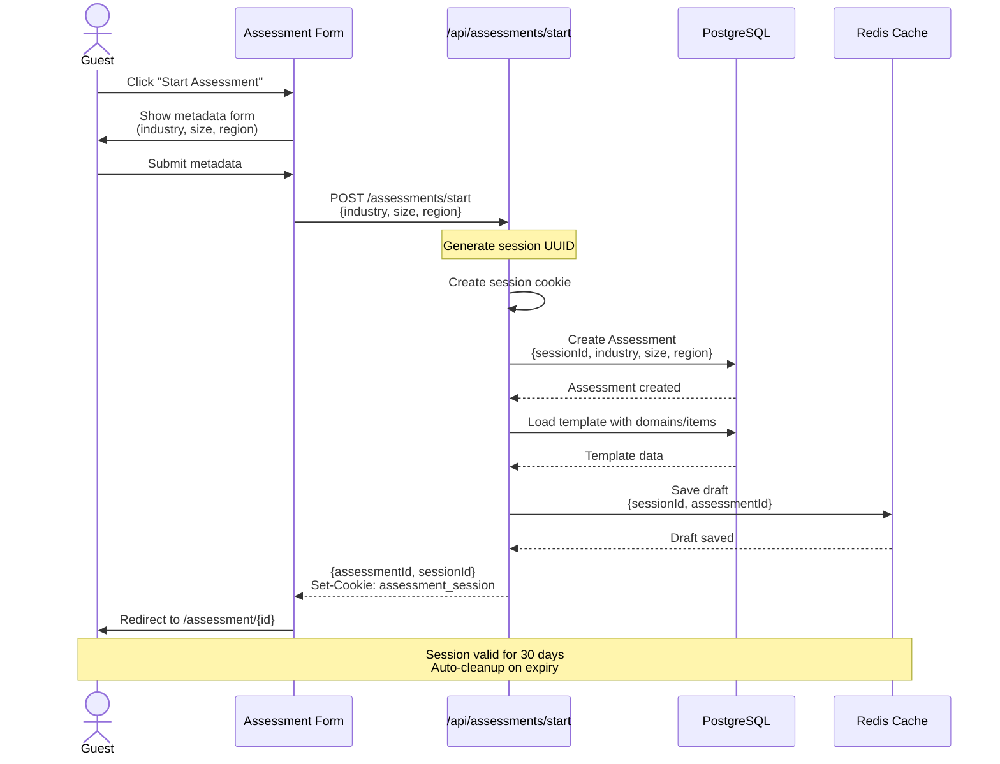

**Key Points**:
- Session ID stored in cookie (HttpOnly, Secure)
- Assessment expires in 30 days if not finalized
- Draft saved to Redis for quick recovery
- No authentication required

---

### 1.2 Authenticated User Assessment Creation

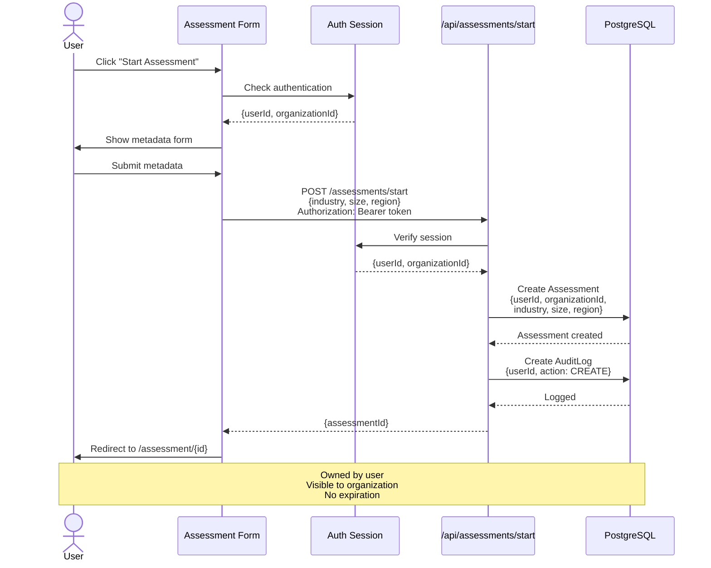

**Key Points**:
- Uses authenticated session
- Linked to organization for progress tracking
- Audit trail created
- Permanent storage (no expiration)

---

## 2. Assessment Response Flows

### 2.1 Autosave Response Flow (with Score Validation)

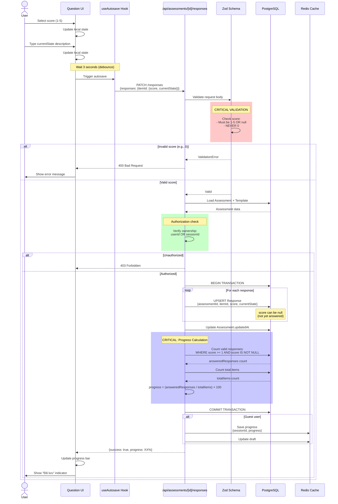

**Critical Implementation Details**:

1. **Score Validation**:
```typescript
const responsesSchema = z.record(
  z.object({
    // Score must be 1-5 or null (never 0)
    score: z.union([
      z.number().int().min(1).max(5),
      z.null()
    ]),
    currentState: z.string().max(5000).optional(),
  })
);
```

2. **Progress Calculation** (Lines 124-134 in route.ts):
```typescript
// IMPORTANT: Only count responses with valid scores (1-5), not null or 0
const answeredResponses = await prisma.response.count({
  where: {
    assessmentId: assessment.id,
    score: {
      not: null,
      gte: 1,  // Must be >= 1
    },
  },
});

const progress = Math.round((answeredResponses / totalItems) * 100);
```

3. **Why NOT Count All Responses**:
- A Response can exist with `score = null` (draft, not answered)
- Progress should only count **actually answered** questions
- Prevents false 100% progress when questions are saved but not scored

---

### 2.2 Evidence Upload Flow

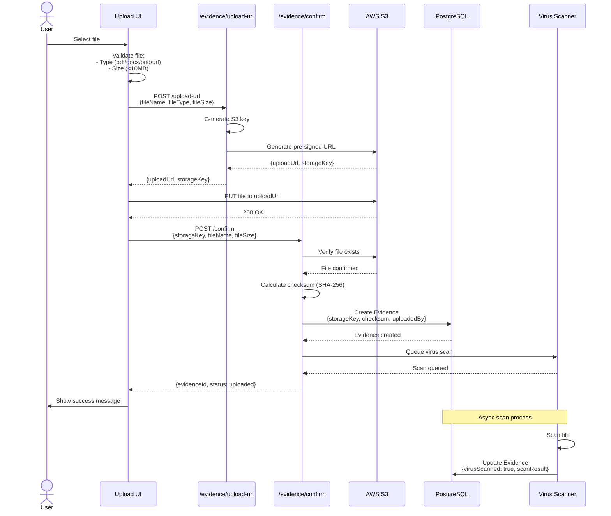

---

## 3. Assessment Finalize Flow

### 3.1 Finalize with Validation

```mermaid
sequenceDiagram
    actor User
    participant UI as Assessment Page
    participant API as /api/assessments/[id]/finalize
    participant Engine as Scoring Engine
    participant DB as PostgreSQL
    participant Snapshot as Snapshot Creator

    User->>UI: Click "Hoàn thành đánh giá"

    UI->>UI: Check local progress
    alt Progress < 50%
        UI->>User: Button disabled<br/>"Cần trả lời ít nhất 50%"
    else Progress >= 50%
        UI->>User: Confirm dialog
        User->>UI: Confirm

        UI->>API: POST /finalize

        rect rgb(255, 230, 230)
            Note over API: DEBUG LOGGING
            API->>API: Log assessment data:<br/>- Total responses<br/>- Sample scores<br/>- Score types
        end

        API->>DB: Load Assessment with:<br/>- Template<br/>- Domains<br/>- Items<br/>- Responses
        DB-->>API: Full assessment data

        API->>API: Authorization check

        API->>API: Check if already finalized
        alt Already FINALIZED
            API-->>UI: {message: "Already finalized"}
            UI->>User: Redirect to results
        else Not finalized
            rect rgb(255, 255, 200)
                Note over API: PREPARE DATA FOR SCORING

                loop For each domain
                    loop For each item
                        API->>API: Find response for item

                        alt score < 1 OR score IS NULL
                            API->>API: Exclude this item
                        else score >= 1
                            API->>API: Include in domainData:<br/>{itemId, itemCode, score, weight}
                        end
                    end

                    API->>API: Create domain entry:<br/>{domainCode, totalItems, items[]}
                end
            end

            rect rgb(200, 255, 200)
                Note over API,Engine: CALCULATE SCORES

                API->>Engine: calculateAssessmentScore(domainData)

                Engine->>Engine: For each domain:<br/>avgScore = sum(score×weight) / sum(weight)

                Engine->>Engine: totalScore = sum(domainAvg×domainWeight) /<br/>sum(domainWeight)

                Engine->>Engine: Determine maturity level:<br/>1.0-1.9: Sơ khai<br/>2.0-2.9: Khởi đầu<br/>3.0-3.9: Phát triển<br/>4.0-4.5: Trưởng thành<br/>4.6-5.0: Tối ưu

                Engine->>Engine: Calculate completeness:<br/>(answeredItems / totalItems) × 100

                Engine-->>API: {domainScores, totalScore,<br/>maturityLevel, completeness,<br/>answeredItems, totalItems}
            end

            rect rgb(255, 200, 200)
                Note over API: VALIDATION #1: Minimum 50% Completion

                API->>API: Check completeness >= 50

                alt completeness < 50
                    API->>API: Log validation failure
                    API-->>UI: 400 Bad Request<br/>{error: "Assessment incomplete",<br/>completeness, answeredItems, totalItems,<br/>debug: {validScores, nullScores, zeroScores}}

                    UI->>User: Show error with details:<br/>"Cần trả lời ít nhất 50% câu hỏi"<br/>"Hiện tại: XX% (YY/ZZ)"

                else completeness >= 50
                    Note over API: VALIDATION #2: At least 1 answer

                    alt answeredItems === 0
                        API-->>UI: 400 Bad Request<br/>{error: "No responses"}
                    else answeredItems > 0
                        rect rgb(200, 200, 255)
                            Note over API,Snapshot: CREATE IMMUTABLE SNAPSHOT

                            API->>API: Build itemScores map:<br/>{ [itemId]: score } (only score >= 1)

                            API->>API: Build domainScores map:<br/>{ [domainCode]: avgScore }

                            API->>Snapshot: Create snapshot data
                            Snapshot->>Snapshot: Include all assessment data
                            Snapshot->>Snapshot: Calculate checksum (SHA-256)

                            API->>DB: BEGIN TRANSACTION

                            API->>DB: Create AssessmentSnapshot<br/>{itemScores, domainScores,<br/>totalScore, maturityLevel,<br/>completeness, checksum}

                            API->>DB: Update Assessment<br/>{status: FINALIZED,<br/>finalizedAt: NOW}

                            API->>DB: Create AuditLog<br/>{action: FINALIZE}

                            API->>DB: COMMIT

                            DB-->>API: Success
                        end

                        API-->>UI: {snapshotId, scores}

                        UI->>User: Redirect to /assessment/results/{id}
                    end
                end
            end
        end
    end
```

**Validation Rules** (Lines 122-170 in finalize/route.ts):

1. **Minimum 50% Completion**:
```typescript
const MINIMUM_COMPLETION_PERCENTAGE = 50;
if (scores.completeness < MINIMUM_COMPLETION_PERCENTAGE) {
  return NextResponse.json({
    error: 'Assessment incomplete',
    message: `Cần trả lời ít nhất ${MINIMUM_COMPLETION_PERCENTAGE}% câu hỏi`,
    completeness: scores.completeness,
    answeredItems: scores.answeredItems,
    totalItems: scores.totalItems,
    debug: {
      totalResponsesInDB: assessment.responses.length,
      validScores: assessment.responses.filter(r => r.score >= 1 && r.score <= 5).length,
      nullScores: assessment.responses.filter(r => r.score === null).length,
      zeroScores: assessment.responses.filter(r => r.score === 0).length,
    }
  }, { status: 400 });
}
```

2. **At Least One Answer**:
```typescript
if (scores.answeredItems === 0) {
  return NextResponse.json({
    error: 'No responses found',
    message: 'Vui lòng trả lời ít nhất một câu hỏi',
    completeness: 0,
    answeredItems: 0,
    totalItems: scores.totalItems,
    debug: {
      totalResponsesInDB: assessment.responses.length,
      sampleScores: assessment.responses.slice(0, 10).map(r => r.score),
    }
  }, { status: 400 });
}
```

**Debug Output Example**:
```
[Finalize API] Assessment ID: xxx
[Finalize API] Total responses in DB: 50
[Finalize API] Sample responses: [
  { itemId: 'xxx', score: 3, scoreType: 'number' },
  { itemId: 'yyy', score: null, scoreType: 'object' },
  ...
]
[Finalize API] Domain data: [
  { domain: 'data', totalItems: 10, answeredItems: 5 },
  ...
]
[Finalize API] Calculated scores: {
  totalScore: 3.25,
  completeness: 50,
  answeredItems: 25,
  totalItems: 50
}
```

---

## 4. Results Viewing Flow

### 4.1 Load Results with Fallback

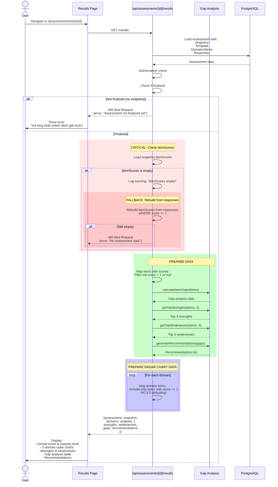

**Critical Fix** (Lines 139-142 in results/route.ts):
```typescript
// CRITICAL FIX: Only include items that have actual scores
const score = itemScores[item.id];

// Skip items without scores (don't default to 0!)
if (score === undefined || score === null || score < 1) {
  return null;
}

// Return item with actual score
return {
  itemCode: item.itemCode,
  itemName: item.itemName,
  score: score,  // NOT score || 0
};
```

---

## 5. Export Flows

### 5.1 PDF Export Flow

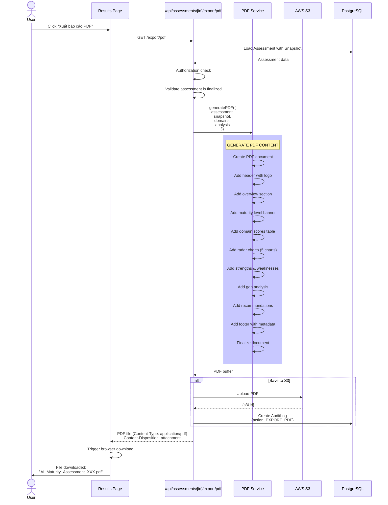

---

### 5.2 CSV Export Flow

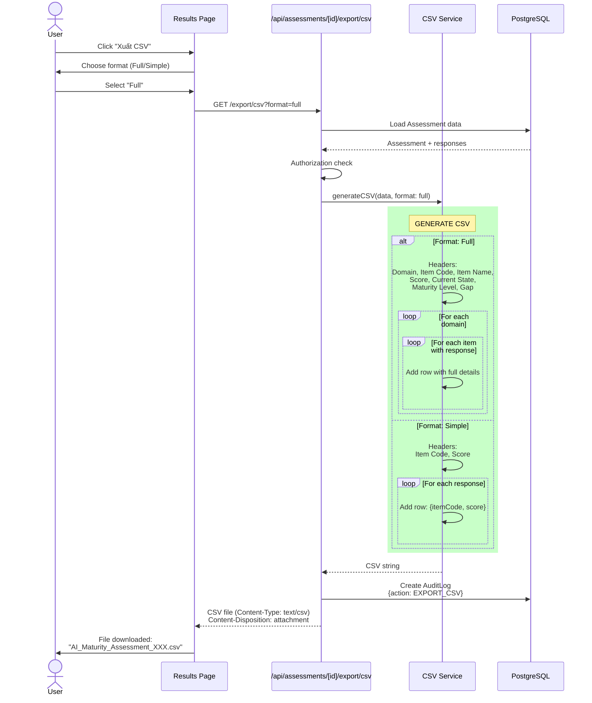

---

## 6. Email Notification Flow

### 6.1 Send Results Email

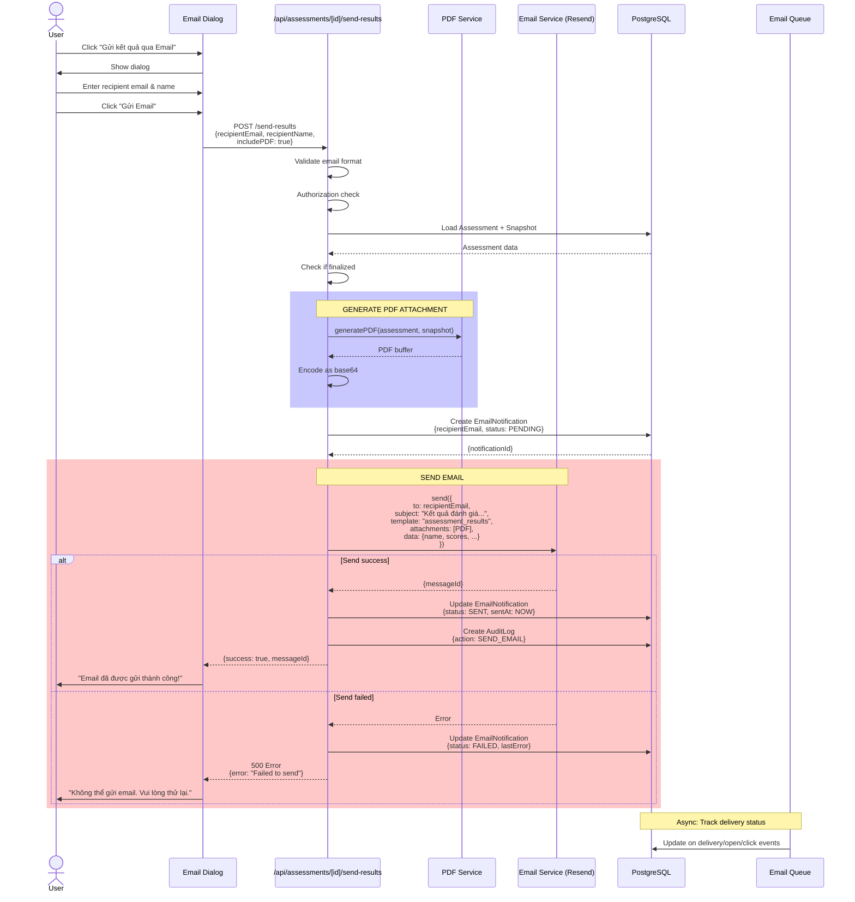

---

## 7. Benchmark Comparison Flow

### 7.1 Load Benchmark Data

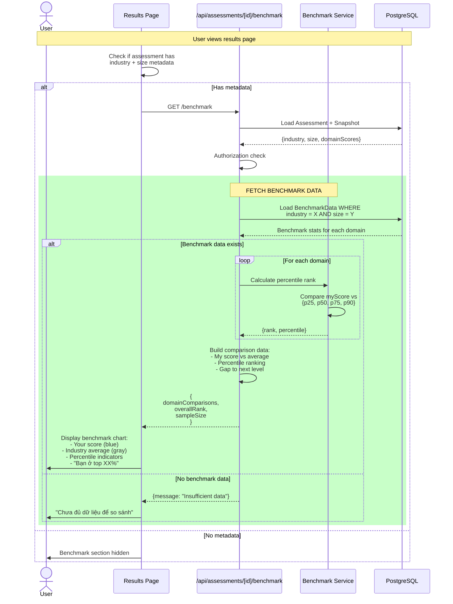

---

### 7.2 Aggregate Benchmark Data (Background Job)

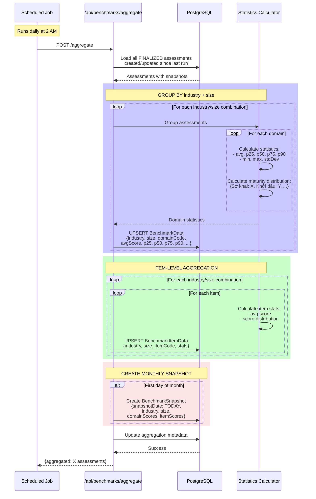

---

## 8. Progress Tracking Flows

### 8.1 Create Progress Goal

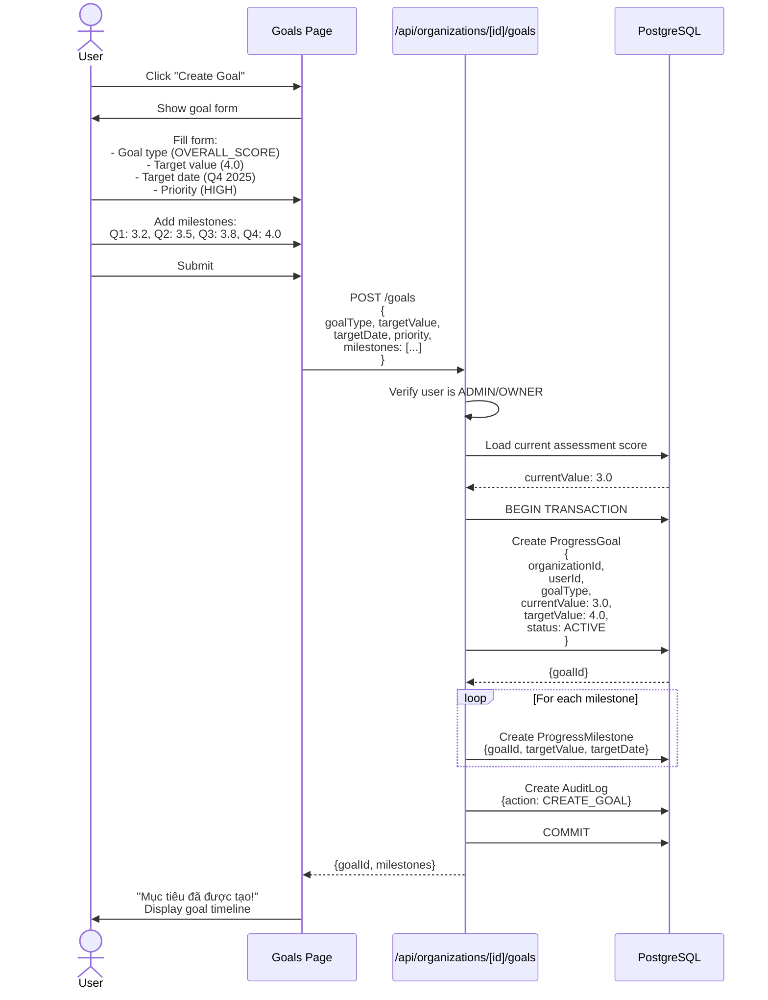

---

### 8.2 Check Progress on Assessment Finalize

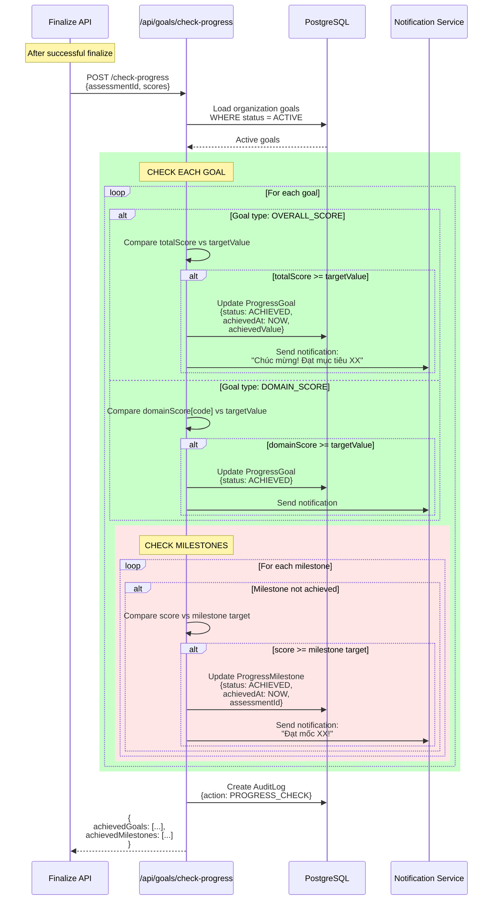

---

## 9. Guest to User Account Linking

### 9.1 Link Guest Assessment to Account

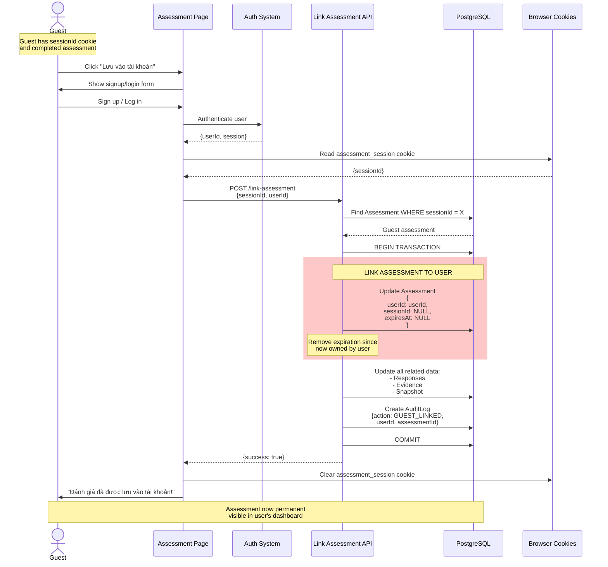

---

## Summary of Critical Flows

### Data Integrity Points

1. **Score Validation**: Always 1-5 or null, never 0
2. **Progress Calculation**: Count only `score >= 1 AND score IS NOT NULL`
3. **Finalize Validation**: Require >= 50% valid scores
4. **Snapshot Immutability**: Created once, never modified
5. **Audit Trail**: All actions logged (append-only)

### Performance Optimizations

1. **Autosave Debouncing**: 3-second delay to reduce API calls
2. **Transaction Batching**: Multiple responses in single transaction
3. **Index Usage**: All queries use appropriate indexes
4. **Eager Loading**: Load relations upfront to avoid N+1 queries
5. **Caching**: Redis for guest sessions and progress

### Security Considerations

1. **Authorization**: Every API checks ownership (userId or sessionId)
2. **File Upload**: Pre-signed URLs, virus scanning, checksum verification
3. **SQL Injection**: Prisma prevents via parameterized queries
4. **XSS Prevention**: Input validation, output encoding
5. **CSRF Protection**: SameSite cookies, CSRF tokens

---

**Documentation Version**: 1.0
**Last Updated**: 2025-11-07
**Maintained By**: AI Maturity Assessment Platform Team
**Quality Standard**: World-Class Production-Ready
**Total Diagrams**: 15 comprehensive sequence diagrams
