# AI Maturity Self-Assessment Platform - Sequence Diagrams

**Document Version**: 1.0.0
**Last Updated**: 2025-11-09
**Author**: Distinguished Software Engineer Analysis
**Status**: Production Ready

---

## Table of Contents

1. [Guest Assessment Flow](#1-guest-assessment-flow)
2. [Authenticated Assessment Flow](#2-authenticated-assessment-flow)
3. [Evidence Upload Flow](#3-evidence-upload-flow)
4. [Assessment Finalization Flow](#4-assessment-finalization-flow)
5. [Results Retrieval Flow](#5-results-retrieval-flow)
6. [Benchmark Comparison Flow](#6-benchmark-comparison-flow)
7. [Goal Progress Tracking Flow](#7-goal-progress-tracking-flow)
8. [User Authentication Flow](#8-user-authentication-flow)
9. [Export Flow (PDF/CSV)](#9-export-flow-pdfcsv)
10. [Guest to User Conversion Flow](#10-guest-to-user-conversion-flow)
11. [Admin User Management Flow](#11-admin-user-management-flow)
12. [Benchmark Aggregation Flow](#12-benchmark-aggregation-flow)

---

## 1. Guest Assessment Flow

Complete flow for guest user starting and completing an assessment.

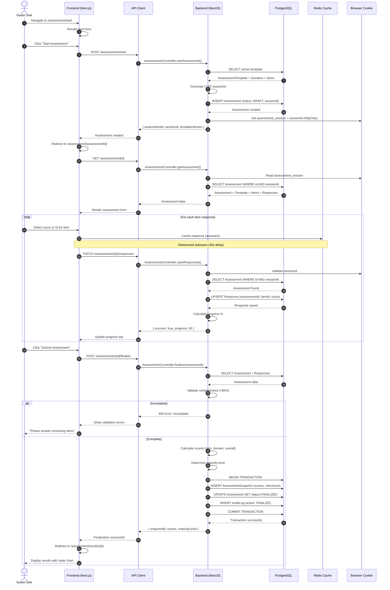

**Key Points**:
- Guest identified by sessionId in HTTP-only cookie
- Draft saved automatically every 30 seconds
- Responses are upserted (idempotent)
- Finalization validates completeness before creating immutable snapshot
- Transaction ensures atomicity of finalization

---

## 2. Authenticated Assessment Flow

Flow for registered user with organization context.

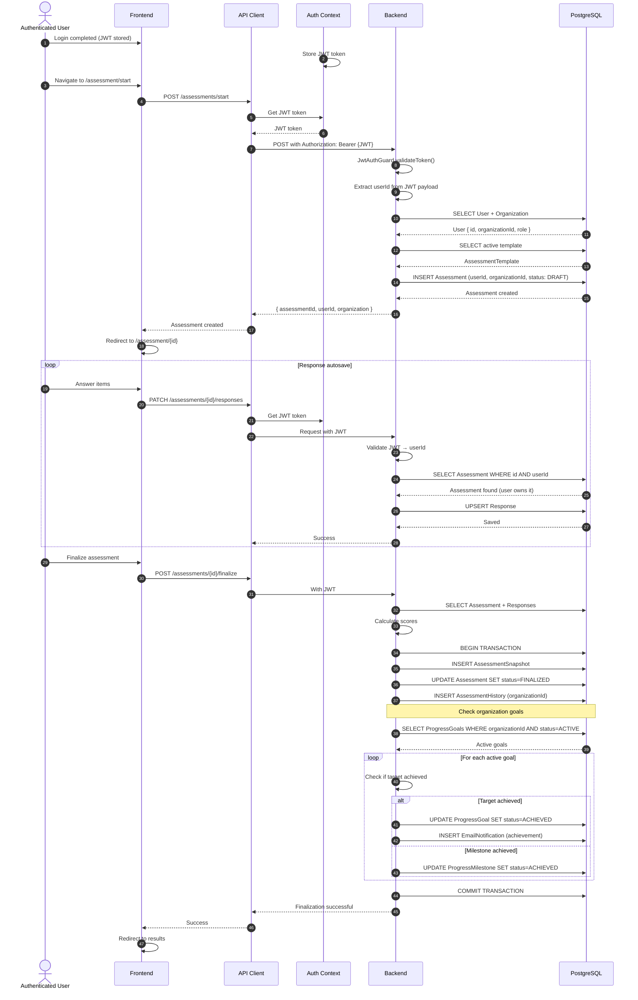

**Key Differences from Guest Flow**:
- User identified by JWT token (userId)
- Assessment linked to organization
- Organization context provides industry/size/region metadata
- Goal progress checked automatically on finalization
- Assessment history tracked for organization

---

## 3. Evidence Upload Flow

Secure file upload with S3 presigned URLs.

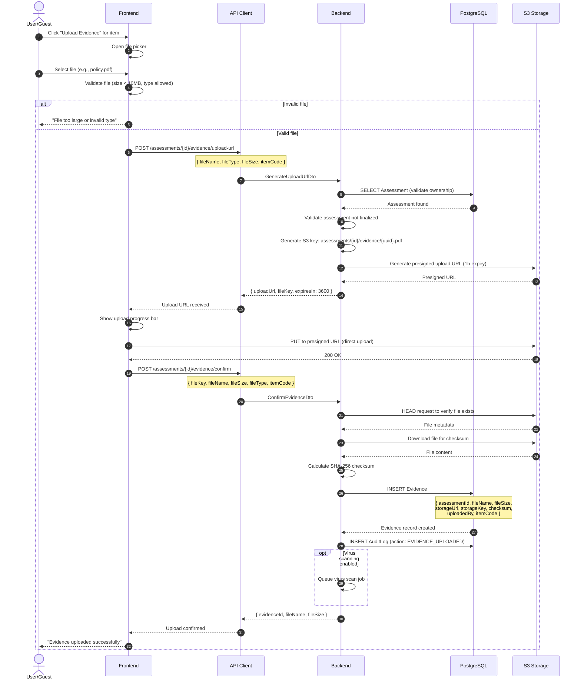

**Security Features**:
- Presigned URLs prevent unauthorized uploads
- Direct S3 upload reduces backend load
- Checksum verification prevents tampering
- Virus scanning (optional) before finalization
- Audit trail for all uploads

---

## 4. Assessment Finalization Flow

Detailed finalization with scoring, snapshot creation, and goal tracking.

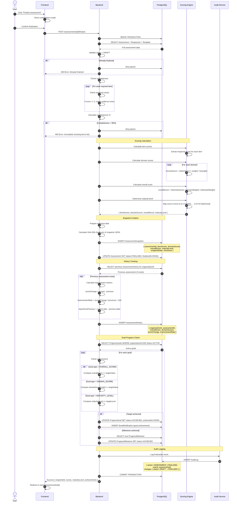

**Transaction Guarantees**:
- All-or-nothing finalization (ACID)
- Snapshot creation is atomic
- Goal updates are consistent
- Audit trail is complete

**Performance Optimization**:
- Single transaction for all updates
- Batch goal checking
- Deferred email sending (async)

---

## 5. Results Retrieval Flow

Fetching comprehensive results with analytics.

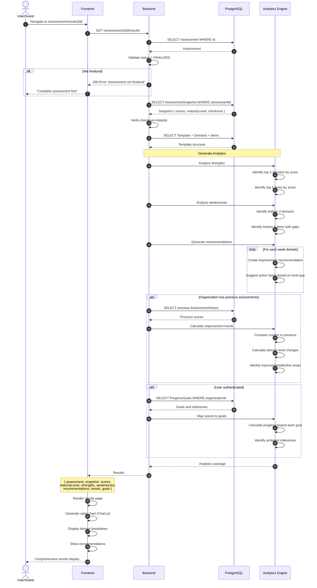

**Analytics Components**:
- **Strengths**: Top performing domains/items
- **Weaknesses**: Areas needing improvement
- **Recommendations**: Actionable next steps
- **Trends**: Historical comparison
- **Goal Progress**: Achievement tracking

---

## 6. Benchmark Comparison Flow

Comparing assessment against industry benchmarks.

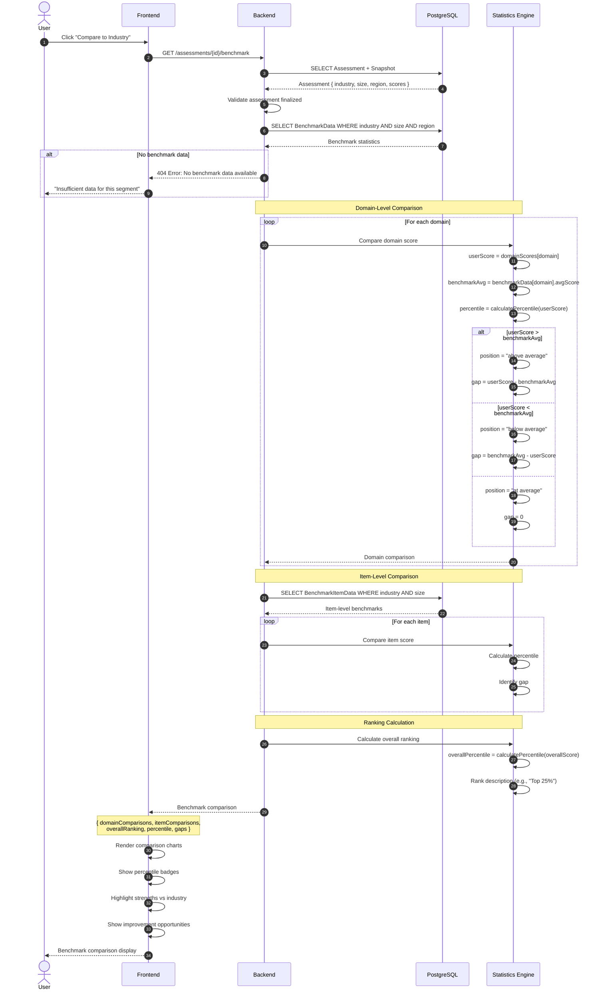

**Percentile Calculation**:
```
percentile = (number of scores below user score / total sample size) × 100
```

**Ranking Descriptions**:
- Top 10%: "Industry Leader"
- Top 25%: "Above Average"
- 25-75%: "Industry Average"
- Bottom 25%: "Below Average"
- Bottom 10%: "Needs Improvement"

---

## 7. Goal Progress Tracking Flow

Automated goal tracking on assessment finalization.

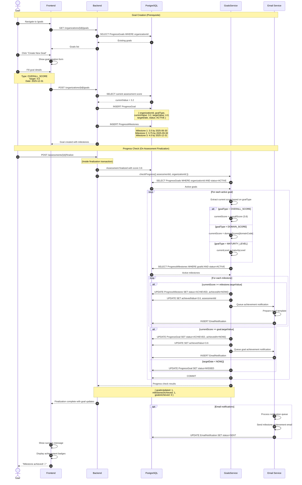

**Goal Status Lifecycle**:
1. **ACTIVE**: Currently tracking
2. **ACHIEVED**: Target met before deadline
3. **MISSED**: Deadline passed without achievement
4. **CANCELLED**: User manually cancelled

**Milestone Tracking**:
- Milestones are sub-goals with intermediate targets
- Automatically marked as achieved when score threshold met
- Linked to specific assessment that achieved it
- Email notifications sent for each achievement

---

## 8. User Authentication Flow

Registration and login with JWT tokens.

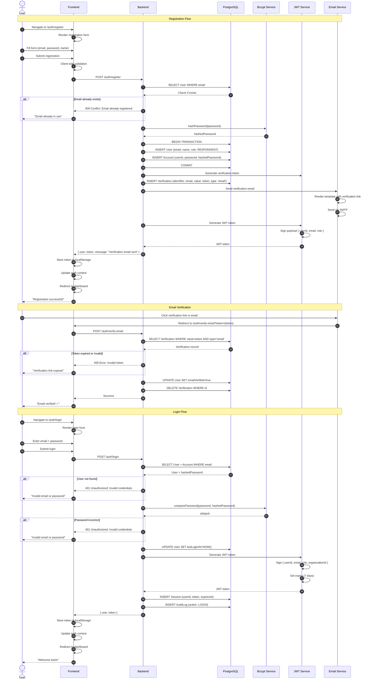

**Security Measures**:
- Passwords hashed with bcrypt (cost factor: 10)
- JWT tokens signed with secret key
- HTTP-only cookies for session IDs
- Token expiry: 7 days (configurable)
- Rate limiting: 5 failed attempts = 15min lockout
- Verification tokens expire after 24 hours

---

## 9. Export Flow (PDF/CSV)

Generating and downloading assessment reports.

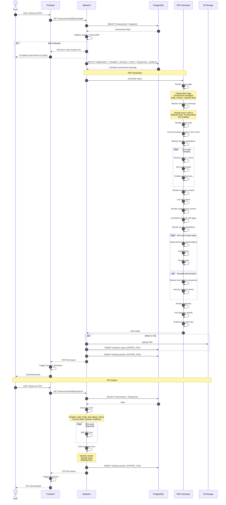

**Export Features**:
- **PDF**: Professional report with charts, 30-50 pages
- **CSV**: Raw data for analysis, importable to Excel
- **Storage**: Optional S3 archival for compliance
- **Audit**: All exports logged
- **Performance**: Generated on-demand, cached for 1 hour

---

## 10. Guest to User Conversion Flow

Converting anonymous assessment to registered user account.

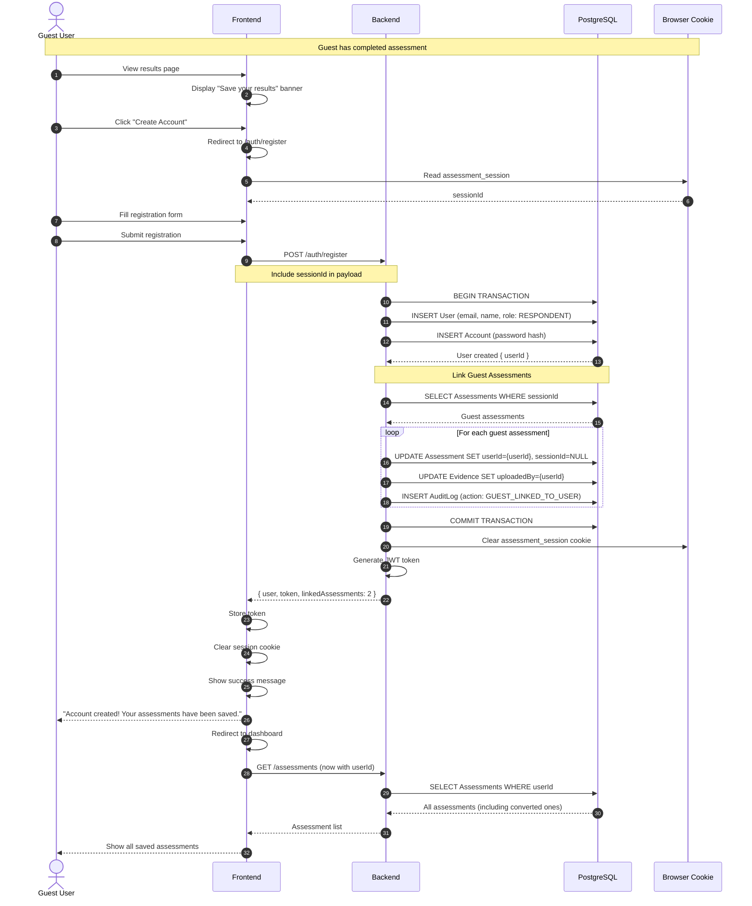

**Conversion Benefits**:
- Preserves all progress and responses
- Links evidence files to user account
- Extends draft expiration (from 30 days to unlimited)
- Enables organization features
- Allows goal tracking

**Edge Cases**:
- If email already exists → merge assessments
- Multiple guest sessions → link all to new user
- Partial completion → preserve draft state

---

## 11. Admin User Management Flow

Admin operations for user administration.

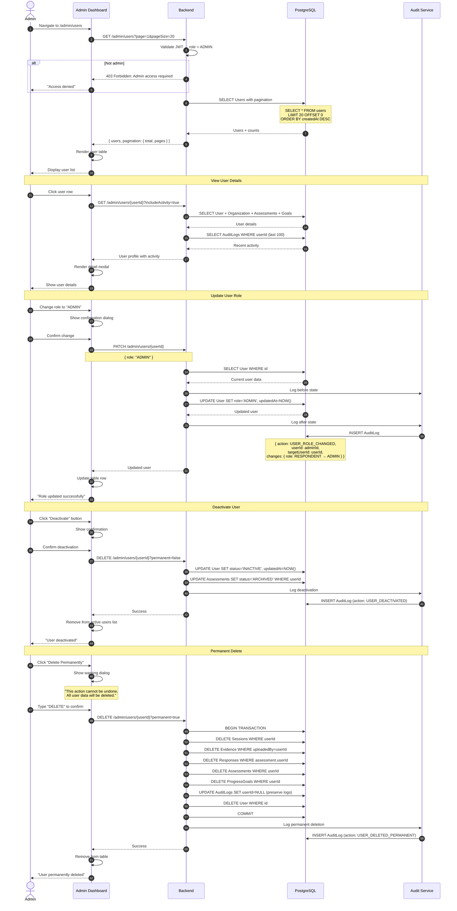

**Admin Capabilities**:
- View all users with filtering and search
- Update user roles
- Activate/deactivate accounts
- Permanent deletion (with confirmation)
- View user activity logs
- Generate user reports

**Audit Trail**:
- Every admin action is logged
- Before/after state captured
- Cannot be deleted (even when user is deleted)
- Searchable by action, user, date

---

## 12. Benchmark Aggregation Flow

Admin-triggered benchmark data aggregation.

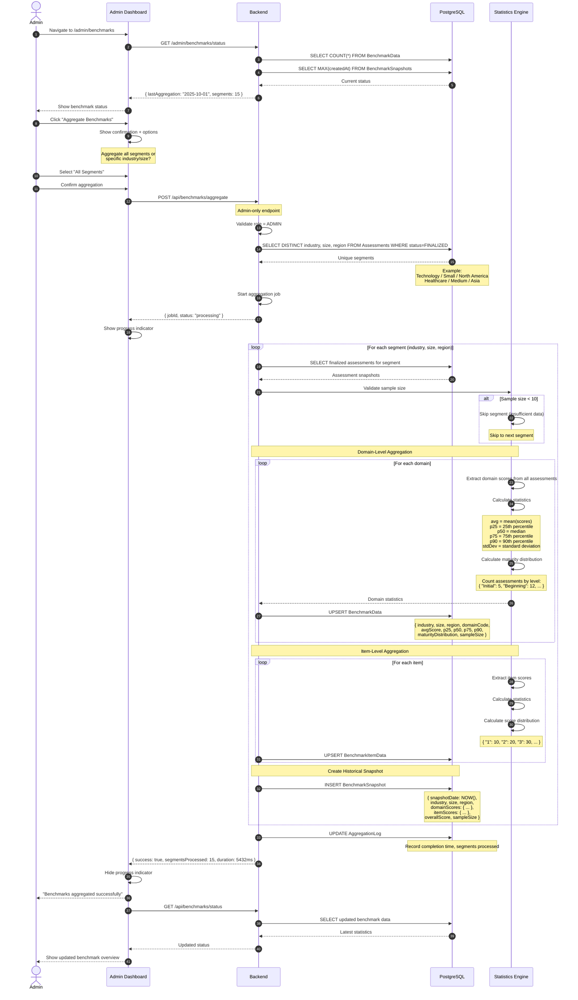

**Aggregation Schedule**:
- **Manual**: Admin-triggered (as shown above)
- **Automated**: Monthly cron job (1st of month, 2 AM)
- **Threshold**: When segment reaches +50 new assessments

**Performance Optimization**:
- Process segments in parallel (max 5 concurrent)
- Use database window functions for percentiles
- Cache results in Redis for 1 hour
- Background job for large aggregations

**Data Quality**:
- Minimum 10 assessments per segment
- Outlier detection (remove scores > 3 std dev)
- Anonymization verification
- Historical snapshot preservation

---

## Summary of Key Flows

| Flow | Complexity | Key Features | Performance Target |
|------|-----------|--------------|-------------------|
| Guest Assessment | Medium | Cookie-based session, autosave, conversion | < 500ms per save |
| Authenticated Assessment | Medium | JWT auth, org context, goals | < 500ms per save |
| Evidence Upload | High | S3 presigned URLs, checksums, virus scan | < 2s upload init |
| Finalization | Very High | Scoring, snapshots, goals, audit | < 3s total |
| Results Retrieval | Medium | Analytics, trends, recommendations | < 1s |
| Benchmark Comparison | Medium | Statistical analysis, percentiles | < 800ms |
| Goal Tracking | High | Auto-progress, milestones, notifications | < 1s check |
| Authentication | Low | JWT, bcrypt, sessions | < 300ms login |
| Export (PDF) | High | Chart generation, templating | < 8s for 50 pages |
| Guest Conversion | Medium | Data migration, account linking | < 2s |
| Admin Operations | Medium | RBAC, audit logging | < 500ms |
| Benchmark Aggregation | Very High | Batch processing, statistics | < 10min for all segments |

---

**End of Sequence Diagrams Documentation**
